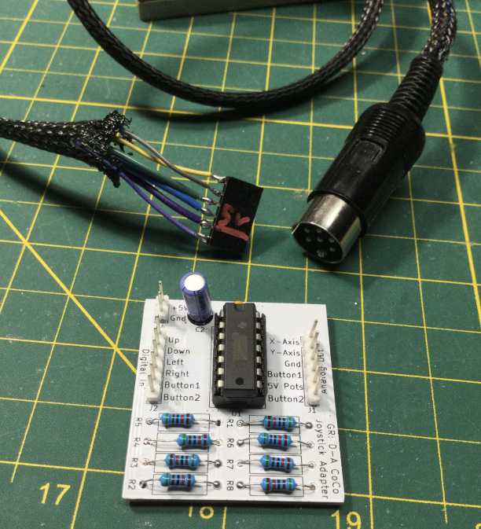

# D_A_CoCo_Joystick_Adapter
Tandy CoCo Joystick Adapter:  Digital to Analog Joystick Circuit
    
Use 5v/GND digital signals to control the analog joystick input of a Tandy Color Computer. 
When input buttons are not pressed, the joystick port sees approx. 5v / 2 = 2.5v, centering the joystick axis.
When a button is pressed, the joystick port sees 0V or 5V, representing the axis being at min or max of the analog range.
